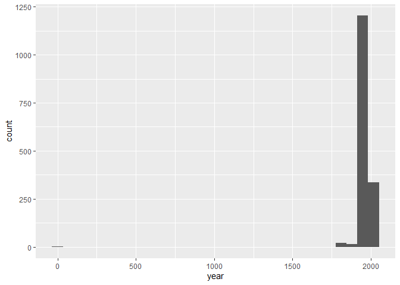
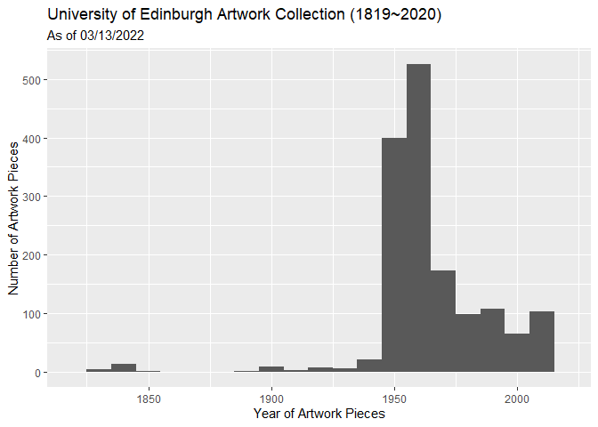

Lab 08 - University of Edinburgh Art Collection
================
Fanyi Zeng
03/11/22

### Load packages and data

``` r
library(robotstxt)
library(rvest)
library(tidyverse)
library(dplyr)
library(skimr)
```

``` r
paths_allowed("https://collections.ed.ac.uk/art)")
```

### Read the page

``` r
# set url
first_url <- "https://collections.ed.ac.uk/art/search/*:*/Collection:%22edinburgh+college+of+art%7C%7C%7CEdinburgh+College+of+Art%22?offset=0"
# read html page
page <- read_html(first_url)
```

### Save the titles

``` r
titles <- page %>%
  html_nodes(".iteminfo") %>%
  html_node("h3 a") %>%
  html_text() %>%
  str_squish()
titles
```

    ##  [1] "Portrait of a Young Woman (1965)"                          
    ##  [2] "Drawing of a Man's Head (1955)"                            
    ##  [3] "Self Portrait against Window (Circa 1983)"                 
    ##  [4] "Untitled - Figured Drawing of Nude Woman on a Couch (1963)"
    ##  [5] "Seated Female Nude (Circa 1968)"                           
    ##  [6] "Male Nude Leaning on a Table (verso)"                      
    ##  [7] "Sienna Cathedral (1982)"                                   
    ##  [8] "Plate"                                                     
    ##  [9] "Virgin and Child"                                          
    ## [10] "Unknown (1950)"

### Save the links

``` r
links <- page %>%
  html_nodes(".iteminfo") %>%   # same nodes
  html_node("h3 a") %>%         # as before
  html_attr("href") %>%         # but get href attribute instead of text
  str_replace(".", "https://collections.ed.ac.uk/art")
links
```

    ##  [1] "https://collections.ed.ac.uk/art/record/21292?highlight=*:*" 
    ##  [2] "https://collections.ed.ac.uk/art/record/20804?highlight=*:*" 
    ##  [3] "https://collections.ed.ac.uk/art/record/22593?highlight=*:*" 
    ##  [4] "https://collections.ed.ac.uk/art/record/99329?highlight=*:*" 
    ##  [5] "https://collections.ed.ac.uk/art/record/20748?highlight=*:*" 
    ##  [6] "https://collections.ed.ac.uk/art/record/22650?highlight=*:*" 
    ##  [7] "https://collections.ed.ac.uk/art/record/102660?highlight=*:*"
    ##  [8] "https://collections.ed.ac.uk/art/record/53674?highlight=*:*" 
    ##  [9] "https://collections.ed.ac.uk/art/record/20571?highlight=*:*" 
    ## [10] "https://collections.ed.ac.uk/art/record/53557?highlight=*:*"

### Save the artists

``` r
artists <- page %>%
  html_nodes(".iteminfo") %>%
  html_node(".artist") %>%
  html_text()
artists
```

    ##  [1] "Irene Scott"      "James Robertson"  "Gwen W. Hardie"   "Gordon Bryce"    
    ##  [5] "Alan T. Johnston" "Unknown"          "Ann Oram"         "Emma Gillies"    
    ##  [9] "Unknown"          "Zygmunt Bukowski"

### Create a dataframe

``` r
first_ten <- tibble(
  title = titles,
  artist = artists,
  link = links
) 
first_ten  
```

    ## # A tibble: 10 x 3
    ##    title                                                      artist  link      
    ##    <chr>                                                      <chr>   <chr>     
    ##  1 Portrait of a Young Woman (1965)                           Irene ~ https://c~
    ##  2 Drawing of a Man's Head (1955)                             James ~ https://c~
    ##  3 Self Portrait against Window (Circa 1983)                  Gwen W~ https://c~
    ##  4 Untitled - Figured Drawing of Nude Woman on a Couch (1963) Gordon~ https://c~
    ##  5 Seated Female Nude (Circa 1968)                            Alan T~ https://c~
    ##  6 Male Nude Leaning on a Table (verso)                       Unknown https://c~
    ##  7 Sienna Cathedral (1982)                                    Ann Or~ https://c~
    ##  8 Plate                                                      Emma G~ https://c~
    ##  9 Virgin and Child                                           Unknown https://c~
    ## 10 Unknown (1950)                                             Zygmun~ https://c~

### Scrape the next page

``` r
# set url
second_url <- "https://collections.ed.ac.uk/art/search/*:*/Collection:%22edinburgh+college+of+art%7C%7C%7CEdinburgh+College+of+Art%22?offset=10"
# read html page
page2 <- read_html(second_url)
```

### Save the titles

``` r
titles2 <- page2 %>%
  html_nodes(".iteminfo") %>%
  html_node("h3 a") %>%
  html_text() %>%
  str_squish()
titles2
```

    ##  [1] "Portrait of Head of a Woman (1952)"              
    ##  [2] "Woman with Fish on her Head"                     
    ##  [3] "Portrait of a Seated Woman (1958)"               
    ##  [4] "etc (2006)"                                      
    ##  [5] "Racing Circuit (1987-1988)"                      
    ##  [6] "Standing Male Nude (1958)"                       
    ##  [7] "Still Life with Jug of Flowers, Goblet and Fruit"
    ##  [8] "Unknown (1952)"                                  
    ##  [9] "Seated Nude (1953)"                              
    ## [10] "Portrait of Woman in White Blouse (1962)"

### Save the links

``` r
links2 <- page2 %>%
  html_nodes(".iteminfo") %>%   # same nodes
  html_node("h3 a") %>%         # as before
  html_attr("href") %>%         # but get href attribute instead of text
  str_replace(".", "https://collections.ed.ac.uk/art")
links2
```

    ##  [1] "https://collections.ed.ac.uk/art/record/20846?highlight=*:*"
    ##  [2] "https://collections.ed.ac.uk/art/record/21530?highlight=*:*"
    ##  [3] "https://collections.ed.ac.uk/art/record/20865?highlight=*:*"
    ##  [4] "https://collections.ed.ac.uk/art/record/99865?highlight=*:*"
    ##  [5] "https://collections.ed.ac.uk/art/record/21456?highlight=*:*"
    ##  [6] "https://collections.ed.ac.uk/art/record/22716?highlight=*:*"
    ##  [7] "https://collections.ed.ac.uk/art/record/20753?highlight=*:*"
    ##  [8] "https://collections.ed.ac.uk/art/record/53513?highlight=*:*"
    ##  [9] "https://collections.ed.ac.uk/art/record/21121?highlight=*:*"
    ## [10] "https://collections.ed.ac.uk/art/record/22714?highlight=*:*"

### Save the artists

``` r
artists2 <- page2 %>%
  html_nodes(".iteminfo") %>%
  html_node(".artist") %>%
  html_text()
artists2
```

    ##  [1] "Frances Walker"             "John Bellany"              
    ##  [3] "Peter Standen"              "Catherine Robbie"          
    ##  [5] "Jane V Hyslop"              "Andrew P. W. Conkie"       
    ##  [7] "Sir William George Gillies" "Rosemary Bagshaw"          
    ##  [9] "Robert L Thompson"          "Elizabeth G. Kellar"

### Create a dataframe

``` r
second_ten <- tibble(
  title = titles2,
  artist = artists2,
  link = links2
) 
second_ten  
```

    ## # A tibble: 10 x 3
    ##    title                                            artist      link            
    ##    <chr>                                            <chr>       <chr>           
    ##  1 Portrait of Head of a Woman (1952)               Frances Wa~ https://collect~
    ##  2 Woman with Fish on her Head                      John Bella~ https://collect~
    ##  3 Portrait of a Seated Woman (1958)                Peter Stan~ https://collect~
    ##  4 etc (2006)                                       Catherine ~ https://collect~
    ##  5 Racing Circuit (1987-1988)                       Jane V Hys~ https://collect~
    ##  6 Standing Male Nude (1958)                        Andrew P. ~ https://collect~
    ##  7 Still Life with Jug of Flowers, Goblet and Fruit Sir Willia~ https://collect~
    ##  8 Unknown (1952)                                   Rosemary B~ https://collect~
    ##  9 Seated Nude (1953)                               Robert L T~ https://collect~
    ## 10 Portrait of Woman in White Blouse (1962)         Elizabeth ~ https://collect~

### Create a function

``` r
scrape_page <- function(url){
   page <- read_html(url)
titles <- page %>%
  html_nodes(".iteminfo") %>%
  html_node("h3 a") %>%
  html_text() %>%
  str_squish()
links <- page %>%
  html_nodes(".iteminfo") %>%   
  html_node("h3 a") %>%         
  html_attr("href") %>%         
  str_replace(".", "https://collections.ed.ac.uk/art")
artists <- page %>%
  html_nodes(".iteminfo") %>%
  html_node(".artist") %>%
  html_text()
ten <- tibble(
  title = titles,
  artist = artists,
  link = links)
}
```

### Test the function

It works!!

``` r
first_page <- scrape_page(first_url)
second_page <- scrape_page(second_url)
```

### Iteration, mapping, & saving as csv

``` r
urls <- paste0("https://collections.ed.ac.uk/art/search/*:*/Collection:%22edinburgh+college+of+art%7C%7C%7CEdinburgh+College+of+Art%22?offset=",seq(0,2980,by=10))
urls
```

    ##   [1] "https://collections.ed.ac.uk/art/search/*:*/Collection:%22edinburgh+college+of+art%7C%7C%7CEdinburgh+College+of+Art%22?offset=0"   
    ##   [2] "https://collections.ed.ac.uk/art/search/*:*/Collection:%22edinburgh+college+of+art%7C%7C%7CEdinburgh+College+of+Art%22?offset=10"  
    ##   [3] "https://collections.ed.ac.uk/art/search/*:*/Collection:%22edinburgh+college+of+art%7C%7C%7CEdinburgh+College+of+Art%22?offset=20"  
    ##   [4] "https://collections.ed.ac.uk/art/search/*:*/Collection:%22edinburgh+college+of+art%7C%7C%7CEdinburgh+College+of+Art%22?offset=30"  
    ##   [5] "https://collections.ed.ac.uk/art/search/*:*/Collection:%22edinburgh+college+of+art%7C%7C%7CEdinburgh+College+of+Art%22?offset=40"  
    ##   [6] "https://collections.ed.ac.uk/art/search/*:*/Collection:%22edinburgh+college+of+art%7C%7C%7CEdinburgh+College+of+Art%22?offset=50"  
    ##   [7] "https://collections.ed.ac.uk/art/search/*:*/Collection:%22edinburgh+college+of+art%7C%7C%7CEdinburgh+College+of+Art%22?offset=60"  
    ##   [8] "https://collections.ed.ac.uk/art/search/*:*/Collection:%22edinburgh+college+of+art%7C%7C%7CEdinburgh+College+of+Art%22?offset=70"  
    ##   [9] "https://collections.ed.ac.uk/art/search/*:*/Collection:%22edinburgh+college+of+art%7C%7C%7CEdinburgh+College+of+Art%22?offset=80"  
    ##  [10] "https://collections.ed.ac.uk/art/search/*:*/Collection:%22edinburgh+college+of+art%7C%7C%7CEdinburgh+College+of+Art%22?offset=90"  
    ##  [11] "https://collections.ed.ac.uk/art/search/*:*/Collection:%22edinburgh+college+of+art%7C%7C%7CEdinburgh+College+of+Art%22?offset=100" 
    ##  [12] "https://collections.ed.ac.uk/art/search/*:*/Collection:%22edinburgh+college+of+art%7C%7C%7CEdinburgh+College+of+Art%22?offset=110" 
    ##  [13] "https://collections.ed.ac.uk/art/search/*:*/Collection:%22edinburgh+college+of+art%7C%7C%7CEdinburgh+College+of+Art%22?offset=120" 
    ##  [14] "https://collections.ed.ac.uk/art/search/*:*/Collection:%22edinburgh+college+of+art%7C%7C%7CEdinburgh+College+of+Art%22?offset=130" 
    ##  [15] "https://collections.ed.ac.uk/art/search/*:*/Collection:%22edinburgh+college+of+art%7C%7C%7CEdinburgh+College+of+Art%22?offset=140" 
    ##  [16] "https://collections.ed.ac.uk/art/search/*:*/Collection:%22edinburgh+college+of+art%7C%7C%7CEdinburgh+College+of+Art%22?offset=150" 
    ##  [17] "https://collections.ed.ac.uk/art/search/*:*/Collection:%22edinburgh+college+of+art%7C%7C%7CEdinburgh+College+of+Art%22?offset=160" 
    ##  [18] "https://collections.ed.ac.uk/art/search/*:*/Collection:%22edinburgh+college+of+art%7C%7C%7CEdinburgh+College+of+Art%22?offset=170" 
    ##  [19] "https://collections.ed.ac.uk/art/search/*:*/Collection:%22edinburgh+college+of+art%7C%7C%7CEdinburgh+College+of+Art%22?offset=180" 
    ##  [20] "https://collections.ed.ac.uk/art/search/*:*/Collection:%22edinburgh+college+of+art%7C%7C%7CEdinburgh+College+of+Art%22?offset=190" 
    ##  [21] "https://collections.ed.ac.uk/art/search/*:*/Collection:%22edinburgh+college+of+art%7C%7C%7CEdinburgh+College+of+Art%22?offset=200" 
    ##  [22] "https://collections.ed.ac.uk/art/search/*:*/Collection:%22edinburgh+college+of+art%7C%7C%7CEdinburgh+College+of+Art%22?offset=210" 
    ##  [23] "https://collections.ed.ac.uk/art/search/*:*/Collection:%22edinburgh+college+of+art%7C%7C%7CEdinburgh+College+of+Art%22?offset=220" 
    ##  [24] "https://collections.ed.ac.uk/art/search/*:*/Collection:%22edinburgh+college+of+art%7C%7C%7CEdinburgh+College+of+Art%22?offset=230" 
    ##  [25] "https://collections.ed.ac.uk/art/search/*:*/Collection:%22edinburgh+college+of+art%7C%7C%7CEdinburgh+College+of+Art%22?offset=240" 
    ##  [26] "https://collections.ed.ac.uk/art/search/*:*/Collection:%22edinburgh+college+of+art%7C%7C%7CEdinburgh+College+of+Art%22?offset=250" 
    ##  [27] "https://collections.ed.ac.uk/art/search/*:*/Collection:%22edinburgh+college+of+art%7C%7C%7CEdinburgh+College+of+Art%22?offset=260" 
    ##  [28] "https://collections.ed.ac.uk/art/search/*:*/Collection:%22edinburgh+college+of+art%7C%7C%7CEdinburgh+College+of+Art%22?offset=270" 
    ##  [29] "https://collections.ed.ac.uk/art/search/*:*/Collection:%22edinburgh+college+of+art%7C%7C%7CEdinburgh+College+of+Art%22?offset=280" 
    ##  [30] "https://collections.ed.ac.uk/art/search/*:*/Collection:%22edinburgh+college+of+art%7C%7C%7CEdinburgh+College+of+Art%22?offset=290" 
    ##  [31] "https://collections.ed.ac.uk/art/search/*:*/Collection:%22edinburgh+college+of+art%7C%7C%7CEdinburgh+College+of+Art%22?offset=300" 
    ##  [32] "https://collections.ed.ac.uk/art/search/*:*/Collection:%22edinburgh+college+of+art%7C%7C%7CEdinburgh+College+of+Art%22?offset=310" 
    ##  [33] "https://collections.ed.ac.uk/art/search/*:*/Collection:%22edinburgh+college+of+art%7C%7C%7CEdinburgh+College+of+Art%22?offset=320" 
    ##  [34] "https://collections.ed.ac.uk/art/search/*:*/Collection:%22edinburgh+college+of+art%7C%7C%7CEdinburgh+College+of+Art%22?offset=330" 
    ##  [35] "https://collections.ed.ac.uk/art/search/*:*/Collection:%22edinburgh+college+of+art%7C%7C%7CEdinburgh+College+of+Art%22?offset=340" 
    ##  [36] "https://collections.ed.ac.uk/art/search/*:*/Collection:%22edinburgh+college+of+art%7C%7C%7CEdinburgh+College+of+Art%22?offset=350" 
    ##  [37] "https://collections.ed.ac.uk/art/search/*:*/Collection:%22edinburgh+college+of+art%7C%7C%7CEdinburgh+College+of+Art%22?offset=360" 
    ##  [38] "https://collections.ed.ac.uk/art/search/*:*/Collection:%22edinburgh+college+of+art%7C%7C%7CEdinburgh+College+of+Art%22?offset=370" 
    ##  [39] "https://collections.ed.ac.uk/art/search/*:*/Collection:%22edinburgh+college+of+art%7C%7C%7CEdinburgh+College+of+Art%22?offset=380" 
    ##  [40] "https://collections.ed.ac.uk/art/search/*:*/Collection:%22edinburgh+college+of+art%7C%7C%7CEdinburgh+College+of+Art%22?offset=390" 
    ##  [41] "https://collections.ed.ac.uk/art/search/*:*/Collection:%22edinburgh+college+of+art%7C%7C%7CEdinburgh+College+of+Art%22?offset=400" 
    ##  [42] "https://collections.ed.ac.uk/art/search/*:*/Collection:%22edinburgh+college+of+art%7C%7C%7CEdinburgh+College+of+Art%22?offset=410" 
    ##  [43] "https://collections.ed.ac.uk/art/search/*:*/Collection:%22edinburgh+college+of+art%7C%7C%7CEdinburgh+College+of+Art%22?offset=420" 
    ##  [44] "https://collections.ed.ac.uk/art/search/*:*/Collection:%22edinburgh+college+of+art%7C%7C%7CEdinburgh+College+of+Art%22?offset=430" 
    ##  [45] "https://collections.ed.ac.uk/art/search/*:*/Collection:%22edinburgh+college+of+art%7C%7C%7CEdinburgh+College+of+Art%22?offset=440" 
    ##  [46] "https://collections.ed.ac.uk/art/search/*:*/Collection:%22edinburgh+college+of+art%7C%7C%7CEdinburgh+College+of+Art%22?offset=450" 
    ##  [47] "https://collections.ed.ac.uk/art/search/*:*/Collection:%22edinburgh+college+of+art%7C%7C%7CEdinburgh+College+of+Art%22?offset=460" 
    ##  [48] "https://collections.ed.ac.uk/art/search/*:*/Collection:%22edinburgh+college+of+art%7C%7C%7CEdinburgh+College+of+Art%22?offset=470" 
    ##  [49] "https://collections.ed.ac.uk/art/search/*:*/Collection:%22edinburgh+college+of+art%7C%7C%7CEdinburgh+College+of+Art%22?offset=480" 
    ##  [50] "https://collections.ed.ac.uk/art/search/*:*/Collection:%22edinburgh+college+of+art%7C%7C%7CEdinburgh+College+of+Art%22?offset=490" 
    ##  [51] "https://collections.ed.ac.uk/art/search/*:*/Collection:%22edinburgh+college+of+art%7C%7C%7CEdinburgh+College+of+Art%22?offset=500" 
    ##  [52] "https://collections.ed.ac.uk/art/search/*:*/Collection:%22edinburgh+college+of+art%7C%7C%7CEdinburgh+College+of+Art%22?offset=510" 
    ##  [53] "https://collections.ed.ac.uk/art/search/*:*/Collection:%22edinburgh+college+of+art%7C%7C%7CEdinburgh+College+of+Art%22?offset=520" 
    ##  [54] "https://collections.ed.ac.uk/art/search/*:*/Collection:%22edinburgh+college+of+art%7C%7C%7CEdinburgh+College+of+Art%22?offset=530" 
    ##  [55] "https://collections.ed.ac.uk/art/search/*:*/Collection:%22edinburgh+college+of+art%7C%7C%7CEdinburgh+College+of+Art%22?offset=540" 
    ##  [56] "https://collections.ed.ac.uk/art/search/*:*/Collection:%22edinburgh+college+of+art%7C%7C%7CEdinburgh+College+of+Art%22?offset=550" 
    ##  [57] "https://collections.ed.ac.uk/art/search/*:*/Collection:%22edinburgh+college+of+art%7C%7C%7CEdinburgh+College+of+Art%22?offset=560" 
    ##  [58] "https://collections.ed.ac.uk/art/search/*:*/Collection:%22edinburgh+college+of+art%7C%7C%7CEdinburgh+College+of+Art%22?offset=570" 
    ##  [59] "https://collections.ed.ac.uk/art/search/*:*/Collection:%22edinburgh+college+of+art%7C%7C%7CEdinburgh+College+of+Art%22?offset=580" 
    ##  [60] "https://collections.ed.ac.uk/art/search/*:*/Collection:%22edinburgh+college+of+art%7C%7C%7CEdinburgh+College+of+Art%22?offset=590" 
    ##  [61] "https://collections.ed.ac.uk/art/search/*:*/Collection:%22edinburgh+college+of+art%7C%7C%7CEdinburgh+College+of+Art%22?offset=600" 
    ##  [62] "https://collections.ed.ac.uk/art/search/*:*/Collection:%22edinburgh+college+of+art%7C%7C%7CEdinburgh+College+of+Art%22?offset=610" 
    ##  [63] "https://collections.ed.ac.uk/art/search/*:*/Collection:%22edinburgh+college+of+art%7C%7C%7CEdinburgh+College+of+Art%22?offset=620" 
    ##  [64] "https://collections.ed.ac.uk/art/search/*:*/Collection:%22edinburgh+college+of+art%7C%7C%7CEdinburgh+College+of+Art%22?offset=630" 
    ##  [65] "https://collections.ed.ac.uk/art/search/*:*/Collection:%22edinburgh+college+of+art%7C%7C%7CEdinburgh+College+of+Art%22?offset=640" 
    ##  [66] "https://collections.ed.ac.uk/art/search/*:*/Collection:%22edinburgh+college+of+art%7C%7C%7CEdinburgh+College+of+Art%22?offset=650" 
    ##  [67] "https://collections.ed.ac.uk/art/search/*:*/Collection:%22edinburgh+college+of+art%7C%7C%7CEdinburgh+College+of+Art%22?offset=660" 
    ##  [68] "https://collections.ed.ac.uk/art/search/*:*/Collection:%22edinburgh+college+of+art%7C%7C%7CEdinburgh+College+of+Art%22?offset=670" 
    ##  [69] "https://collections.ed.ac.uk/art/search/*:*/Collection:%22edinburgh+college+of+art%7C%7C%7CEdinburgh+College+of+Art%22?offset=680" 
    ##  [70] "https://collections.ed.ac.uk/art/search/*:*/Collection:%22edinburgh+college+of+art%7C%7C%7CEdinburgh+College+of+Art%22?offset=690" 
    ##  [71] "https://collections.ed.ac.uk/art/search/*:*/Collection:%22edinburgh+college+of+art%7C%7C%7CEdinburgh+College+of+Art%22?offset=700" 
    ##  [72] "https://collections.ed.ac.uk/art/search/*:*/Collection:%22edinburgh+college+of+art%7C%7C%7CEdinburgh+College+of+Art%22?offset=710" 
    ##  [73] "https://collections.ed.ac.uk/art/search/*:*/Collection:%22edinburgh+college+of+art%7C%7C%7CEdinburgh+College+of+Art%22?offset=720" 
    ##  [74] "https://collections.ed.ac.uk/art/search/*:*/Collection:%22edinburgh+college+of+art%7C%7C%7CEdinburgh+College+of+Art%22?offset=730" 
    ##  [75] "https://collections.ed.ac.uk/art/search/*:*/Collection:%22edinburgh+college+of+art%7C%7C%7CEdinburgh+College+of+Art%22?offset=740" 
    ##  [76] "https://collections.ed.ac.uk/art/search/*:*/Collection:%22edinburgh+college+of+art%7C%7C%7CEdinburgh+College+of+Art%22?offset=750" 
    ##  [77] "https://collections.ed.ac.uk/art/search/*:*/Collection:%22edinburgh+college+of+art%7C%7C%7CEdinburgh+College+of+Art%22?offset=760" 
    ##  [78] "https://collections.ed.ac.uk/art/search/*:*/Collection:%22edinburgh+college+of+art%7C%7C%7CEdinburgh+College+of+Art%22?offset=770" 
    ##  [79] "https://collections.ed.ac.uk/art/search/*:*/Collection:%22edinburgh+college+of+art%7C%7C%7CEdinburgh+College+of+Art%22?offset=780" 
    ##  [80] "https://collections.ed.ac.uk/art/search/*:*/Collection:%22edinburgh+college+of+art%7C%7C%7CEdinburgh+College+of+Art%22?offset=790" 
    ##  [81] "https://collections.ed.ac.uk/art/search/*:*/Collection:%22edinburgh+college+of+art%7C%7C%7CEdinburgh+College+of+Art%22?offset=800" 
    ##  [82] "https://collections.ed.ac.uk/art/search/*:*/Collection:%22edinburgh+college+of+art%7C%7C%7CEdinburgh+College+of+Art%22?offset=810" 
    ##  [83] "https://collections.ed.ac.uk/art/search/*:*/Collection:%22edinburgh+college+of+art%7C%7C%7CEdinburgh+College+of+Art%22?offset=820" 
    ##  [84] "https://collections.ed.ac.uk/art/search/*:*/Collection:%22edinburgh+college+of+art%7C%7C%7CEdinburgh+College+of+Art%22?offset=830" 
    ##  [85] "https://collections.ed.ac.uk/art/search/*:*/Collection:%22edinburgh+college+of+art%7C%7C%7CEdinburgh+College+of+Art%22?offset=840" 
    ##  [86] "https://collections.ed.ac.uk/art/search/*:*/Collection:%22edinburgh+college+of+art%7C%7C%7CEdinburgh+College+of+Art%22?offset=850" 
    ##  [87] "https://collections.ed.ac.uk/art/search/*:*/Collection:%22edinburgh+college+of+art%7C%7C%7CEdinburgh+College+of+Art%22?offset=860" 
    ##  [88] "https://collections.ed.ac.uk/art/search/*:*/Collection:%22edinburgh+college+of+art%7C%7C%7CEdinburgh+College+of+Art%22?offset=870" 
    ##  [89] "https://collections.ed.ac.uk/art/search/*:*/Collection:%22edinburgh+college+of+art%7C%7C%7CEdinburgh+College+of+Art%22?offset=880" 
    ##  [90] "https://collections.ed.ac.uk/art/search/*:*/Collection:%22edinburgh+college+of+art%7C%7C%7CEdinburgh+College+of+Art%22?offset=890" 
    ##  [91] "https://collections.ed.ac.uk/art/search/*:*/Collection:%22edinburgh+college+of+art%7C%7C%7CEdinburgh+College+of+Art%22?offset=900" 
    ##  [92] "https://collections.ed.ac.uk/art/search/*:*/Collection:%22edinburgh+college+of+art%7C%7C%7CEdinburgh+College+of+Art%22?offset=910" 
    ##  [93] "https://collections.ed.ac.uk/art/search/*:*/Collection:%22edinburgh+college+of+art%7C%7C%7CEdinburgh+College+of+Art%22?offset=920" 
    ##  [94] "https://collections.ed.ac.uk/art/search/*:*/Collection:%22edinburgh+college+of+art%7C%7C%7CEdinburgh+College+of+Art%22?offset=930" 
    ##  [95] "https://collections.ed.ac.uk/art/search/*:*/Collection:%22edinburgh+college+of+art%7C%7C%7CEdinburgh+College+of+Art%22?offset=940" 
    ##  [96] "https://collections.ed.ac.uk/art/search/*:*/Collection:%22edinburgh+college+of+art%7C%7C%7CEdinburgh+College+of+Art%22?offset=950" 
    ##  [97] "https://collections.ed.ac.uk/art/search/*:*/Collection:%22edinburgh+college+of+art%7C%7C%7CEdinburgh+College+of+Art%22?offset=960" 
    ##  [98] "https://collections.ed.ac.uk/art/search/*:*/Collection:%22edinburgh+college+of+art%7C%7C%7CEdinburgh+College+of+Art%22?offset=970" 
    ##  [99] "https://collections.ed.ac.uk/art/search/*:*/Collection:%22edinburgh+college+of+art%7C%7C%7CEdinburgh+College+of+Art%22?offset=980" 
    ## [100] "https://collections.ed.ac.uk/art/search/*:*/Collection:%22edinburgh+college+of+art%7C%7C%7CEdinburgh+College+of+Art%22?offset=990" 
    ## [101] "https://collections.ed.ac.uk/art/search/*:*/Collection:%22edinburgh+college+of+art%7C%7C%7CEdinburgh+College+of+Art%22?offset=1000"
    ## [102] "https://collections.ed.ac.uk/art/search/*:*/Collection:%22edinburgh+college+of+art%7C%7C%7CEdinburgh+College+of+Art%22?offset=1010"
    ## [103] "https://collections.ed.ac.uk/art/search/*:*/Collection:%22edinburgh+college+of+art%7C%7C%7CEdinburgh+College+of+Art%22?offset=1020"
    ## [104] "https://collections.ed.ac.uk/art/search/*:*/Collection:%22edinburgh+college+of+art%7C%7C%7CEdinburgh+College+of+Art%22?offset=1030"
    ## [105] "https://collections.ed.ac.uk/art/search/*:*/Collection:%22edinburgh+college+of+art%7C%7C%7CEdinburgh+College+of+Art%22?offset=1040"
    ## [106] "https://collections.ed.ac.uk/art/search/*:*/Collection:%22edinburgh+college+of+art%7C%7C%7CEdinburgh+College+of+Art%22?offset=1050"
    ## [107] "https://collections.ed.ac.uk/art/search/*:*/Collection:%22edinburgh+college+of+art%7C%7C%7CEdinburgh+College+of+Art%22?offset=1060"
    ## [108] "https://collections.ed.ac.uk/art/search/*:*/Collection:%22edinburgh+college+of+art%7C%7C%7CEdinburgh+College+of+Art%22?offset=1070"
    ## [109] "https://collections.ed.ac.uk/art/search/*:*/Collection:%22edinburgh+college+of+art%7C%7C%7CEdinburgh+College+of+Art%22?offset=1080"
    ## [110] "https://collections.ed.ac.uk/art/search/*:*/Collection:%22edinburgh+college+of+art%7C%7C%7CEdinburgh+College+of+Art%22?offset=1090"
    ## [111] "https://collections.ed.ac.uk/art/search/*:*/Collection:%22edinburgh+college+of+art%7C%7C%7CEdinburgh+College+of+Art%22?offset=1100"
    ## [112] "https://collections.ed.ac.uk/art/search/*:*/Collection:%22edinburgh+college+of+art%7C%7C%7CEdinburgh+College+of+Art%22?offset=1110"
    ## [113] "https://collections.ed.ac.uk/art/search/*:*/Collection:%22edinburgh+college+of+art%7C%7C%7CEdinburgh+College+of+Art%22?offset=1120"
    ## [114] "https://collections.ed.ac.uk/art/search/*:*/Collection:%22edinburgh+college+of+art%7C%7C%7CEdinburgh+College+of+Art%22?offset=1130"
    ## [115] "https://collections.ed.ac.uk/art/search/*:*/Collection:%22edinburgh+college+of+art%7C%7C%7CEdinburgh+College+of+Art%22?offset=1140"
    ## [116] "https://collections.ed.ac.uk/art/search/*:*/Collection:%22edinburgh+college+of+art%7C%7C%7CEdinburgh+College+of+Art%22?offset=1150"
    ## [117] "https://collections.ed.ac.uk/art/search/*:*/Collection:%22edinburgh+college+of+art%7C%7C%7CEdinburgh+College+of+Art%22?offset=1160"
    ## [118] "https://collections.ed.ac.uk/art/search/*:*/Collection:%22edinburgh+college+of+art%7C%7C%7CEdinburgh+College+of+Art%22?offset=1170"
    ## [119] "https://collections.ed.ac.uk/art/search/*:*/Collection:%22edinburgh+college+of+art%7C%7C%7CEdinburgh+College+of+Art%22?offset=1180"
    ## [120] "https://collections.ed.ac.uk/art/search/*:*/Collection:%22edinburgh+college+of+art%7C%7C%7CEdinburgh+College+of+Art%22?offset=1190"
    ## [121] "https://collections.ed.ac.uk/art/search/*:*/Collection:%22edinburgh+college+of+art%7C%7C%7CEdinburgh+College+of+Art%22?offset=1200"
    ## [122] "https://collections.ed.ac.uk/art/search/*:*/Collection:%22edinburgh+college+of+art%7C%7C%7CEdinburgh+College+of+Art%22?offset=1210"
    ## [123] "https://collections.ed.ac.uk/art/search/*:*/Collection:%22edinburgh+college+of+art%7C%7C%7CEdinburgh+College+of+Art%22?offset=1220"
    ## [124] "https://collections.ed.ac.uk/art/search/*:*/Collection:%22edinburgh+college+of+art%7C%7C%7CEdinburgh+College+of+Art%22?offset=1230"
    ## [125] "https://collections.ed.ac.uk/art/search/*:*/Collection:%22edinburgh+college+of+art%7C%7C%7CEdinburgh+College+of+Art%22?offset=1240"
    ## [126] "https://collections.ed.ac.uk/art/search/*:*/Collection:%22edinburgh+college+of+art%7C%7C%7CEdinburgh+College+of+Art%22?offset=1250"
    ## [127] "https://collections.ed.ac.uk/art/search/*:*/Collection:%22edinburgh+college+of+art%7C%7C%7CEdinburgh+College+of+Art%22?offset=1260"
    ## [128] "https://collections.ed.ac.uk/art/search/*:*/Collection:%22edinburgh+college+of+art%7C%7C%7CEdinburgh+College+of+Art%22?offset=1270"
    ## [129] "https://collections.ed.ac.uk/art/search/*:*/Collection:%22edinburgh+college+of+art%7C%7C%7CEdinburgh+College+of+Art%22?offset=1280"
    ## [130] "https://collections.ed.ac.uk/art/search/*:*/Collection:%22edinburgh+college+of+art%7C%7C%7CEdinburgh+College+of+Art%22?offset=1290"
    ## [131] "https://collections.ed.ac.uk/art/search/*:*/Collection:%22edinburgh+college+of+art%7C%7C%7CEdinburgh+College+of+Art%22?offset=1300"
    ## [132] "https://collections.ed.ac.uk/art/search/*:*/Collection:%22edinburgh+college+of+art%7C%7C%7CEdinburgh+College+of+Art%22?offset=1310"
    ## [133] "https://collections.ed.ac.uk/art/search/*:*/Collection:%22edinburgh+college+of+art%7C%7C%7CEdinburgh+College+of+Art%22?offset=1320"
    ## [134] "https://collections.ed.ac.uk/art/search/*:*/Collection:%22edinburgh+college+of+art%7C%7C%7CEdinburgh+College+of+Art%22?offset=1330"
    ## [135] "https://collections.ed.ac.uk/art/search/*:*/Collection:%22edinburgh+college+of+art%7C%7C%7CEdinburgh+College+of+Art%22?offset=1340"
    ## [136] "https://collections.ed.ac.uk/art/search/*:*/Collection:%22edinburgh+college+of+art%7C%7C%7CEdinburgh+College+of+Art%22?offset=1350"
    ## [137] "https://collections.ed.ac.uk/art/search/*:*/Collection:%22edinburgh+college+of+art%7C%7C%7CEdinburgh+College+of+Art%22?offset=1360"
    ## [138] "https://collections.ed.ac.uk/art/search/*:*/Collection:%22edinburgh+college+of+art%7C%7C%7CEdinburgh+College+of+Art%22?offset=1370"
    ## [139] "https://collections.ed.ac.uk/art/search/*:*/Collection:%22edinburgh+college+of+art%7C%7C%7CEdinburgh+College+of+Art%22?offset=1380"
    ## [140] "https://collections.ed.ac.uk/art/search/*:*/Collection:%22edinburgh+college+of+art%7C%7C%7CEdinburgh+College+of+Art%22?offset=1390"
    ## [141] "https://collections.ed.ac.uk/art/search/*:*/Collection:%22edinburgh+college+of+art%7C%7C%7CEdinburgh+College+of+Art%22?offset=1400"
    ## [142] "https://collections.ed.ac.uk/art/search/*:*/Collection:%22edinburgh+college+of+art%7C%7C%7CEdinburgh+College+of+Art%22?offset=1410"
    ## [143] "https://collections.ed.ac.uk/art/search/*:*/Collection:%22edinburgh+college+of+art%7C%7C%7CEdinburgh+College+of+Art%22?offset=1420"
    ## [144] "https://collections.ed.ac.uk/art/search/*:*/Collection:%22edinburgh+college+of+art%7C%7C%7CEdinburgh+College+of+Art%22?offset=1430"
    ## [145] "https://collections.ed.ac.uk/art/search/*:*/Collection:%22edinburgh+college+of+art%7C%7C%7CEdinburgh+College+of+Art%22?offset=1440"
    ## [146] "https://collections.ed.ac.uk/art/search/*:*/Collection:%22edinburgh+college+of+art%7C%7C%7CEdinburgh+College+of+Art%22?offset=1450"
    ## [147] "https://collections.ed.ac.uk/art/search/*:*/Collection:%22edinburgh+college+of+art%7C%7C%7CEdinburgh+College+of+Art%22?offset=1460"
    ## [148] "https://collections.ed.ac.uk/art/search/*:*/Collection:%22edinburgh+college+of+art%7C%7C%7CEdinburgh+College+of+Art%22?offset=1470"
    ## [149] "https://collections.ed.ac.uk/art/search/*:*/Collection:%22edinburgh+college+of+art%7C%7C%7CEdinburgh+College+of+Art%22?offset=1480"
    ## [150] "https://collections.ed.ac.uk/art/search/*:*/Collection:%22edinburgh+college+of+art%7C%7C%7CEdinburgh+College+of+Art%22?offset=1490"
    ## [151] "https://collections.ed.ac.uk/art/search/*:*/Collection:%22edinburgh+college+of+art%7C%7C%7CEdinburgh+College+of+Art%22?offset=1500"
    ## [152] "https://collections.ed.ac.uk/art/search/*:*/Collection:%22edinburgh+college+of+art%7C%7C%7CEdinburgh+College+of+Art%22?offset=1510"
    ## [153] "https://collections.ed.ac.uk/art/search/*:*/Collection:%22edinburgh+college+of+art%7C%7C%7CEdinburgh+College+of+Art%22?offset=1520"
    ## [154] "https://collections.ed.ac.uk/art/search/*:*/Collection:%22edinburgh+college+of+art%7C%7C%7CEdinburgh+College+of+Art%22?offset=1530"
    ## [155] "https://collections.ed.ac.uk/art/search/*:*/Collection:%22edinburgh+college+of+art%7C%7C%7CEdinburgh+College+of+Art%22?offset=1540"
    ## [156] "https://collections.ed.ac.uk/art/search/*:*/Collection:%22edinburgh+college+of+art%7C%7C%7CEdinburgh+College+of+Art%22?offset=1550"
    ## [157] "https://collections.ed.ac.uk/art/search/*:*/Collection:%22edinburgh+college+of+art%7C%7C%7CEdinburgh+College+of+Art%22?offset=1560"
    ## [158] "https://collections.ed.ac.uk/art/search/*:*/Collection:%22edinburgh+college+of+art%7C%7C%7CEdinburgh+College+of+Art%22?offset=1570"
    ## [159] "https://collections.ed.ac.uk/art/search/*:*/Collection:%22edinburgh+college+of+art%7C%7C%7CEdinburgh+College+of+Art%22?offset=1580"
    ## [160] "https://collections.ed.ac.uk/art/search/*:*/Collection:%22edinburgh+college+of+art%7C%7C%7CEdinburgh+College+of+Art%22?offset=1590"
    ## [161] "https://collections.ed.ac.uk/art/search/*:*/Collection:%22edinburgh+college+of+art%7C%7C%7CEdinburgh+College+of+Art%22?offset=1600"
    ## [162] "https://collections.ed.ac.uk/art/search/*:*/Collection:%22edinburgh+college+of+art%7C%7C%7CEdinburgh+College+of+Art%22?offset=1610"
    ## [163] "https://collections.ed.ac.uk/art/search/*:*/Collection:%22edinburgh+college+of+art%7C%7C%7CEdinburgh+College+of+Art%22?offset=1620"
    ## [164] "https://collections.ed.ac.uk/art/search/*:*/Collection:%22edinburgh+college+of+art%7C%7C%7CEdinburgh+College+of+Art%22?offset=1630"
    ## [165] "https://collections.ed.ac.uk/art/search/*:*/Collection:%22edinburgh+college+of+art%7C%7C%7CEdinburgh+College+of+Art%22?offset=1640"
    ## [166] "https://collections.ed.ac.uk/art/search/*:*/Collection:%22edinburgh+college+of+art%7C%7C%7CEdinburgh+College+of+Art%22?offset=1650"
    ## [167] "https://collections.ed.ac.uk/art/search/*:*/Collection:%22edinburgh+college+of+art%7C%7C%7CEdinburgh+College+of+Art%22?offset=1660"
    ## [168] "https://collections.ed.ac.uk/art/search/*:*/Collection:%22edinburgh+college+of+art%7C%7C%7CEdinburgh+College+of+Art%22?offset=1670"
    ## [169] "https://collections.ed.ac.uk/art/search/*:*/Collection:%22edinburgh+college+of+art%7C%7C%7CEdinburgh+College+of+Art%22?offset=1680"
    ## [170] "https://collections.ed.ac.uk/art/search/*:*/Collection:%22edinburgh+college+of+art%7C%7C%7CEdinburgh+College+of+Art%22?offset=1690"
    ## [171] "https://collections.ed.ac.uk/art/search/*:*/Collection:%22edinburgh+college+of+art%7C%7C%7CEdinburgh+College+of+Art%22?offset=1700"
    ## [172] "https://collections.ed.ac.uk/art/search/*:*/Collection:%22edinburgh+college+of+art%7C%7C%7CEdinburgh+College+of+Art%22?offset=1710"
    ## [173] "https://collections.ed.ac.uk/art/search/*:*/Collection:%22edinburgh+college+of+art%7C%7C%7CEdinburgh+College+of+Art%22?offset=1720"
    ## [174] "https://collections.ed.ac.uk/art/search/*:*/Collection:%22edinburgh+college+of+art%7C%7C%7CEdinburgh+College+of+Art%22?offset=1730"
    ## [175] "https://collections.ed.ac.uk/art/search/*:*/Collection:%22edinburgh+college+of+art%7C%7C%7CEdinburgh+College+of+Art%22?offset=1740"
    ## [176] "https://collections.ed.ac.uk/art/search/*:*/Collection:%22edinburgh+college+of+art%7C%7C%7CEdinburgh+College+of+Art%22?offset=1750"
    ## [177] "https://collections.ed.ac.uk/art/search/*:*/Collection:%22edinburgh+college+of+art%7C%7C%7CEdinburgh+College+of+Art%22?offset=1760"
    ## [178] "https://collections.ed.ac.uk/art/search/*:*/Collection:%22edinburgh+college+of+art%7C%7C%7CEdinburgh+College+of+Art%22?offset=1770"
    ## [179] "https://collections.ed.ac.uk/art/search/*:*/Collection:%22edinburgh+college+of+art%7C%7C%7CEdinburgh+College+of+Art%22?offset=1780"
    ## [180] "https://collections.ed.ac.uk/art/search/*:*/Collection:%22edinburgh+college+of+art%7C%7C%7CEdinburgh+College+of+Art%22?offset=1790"
    ## [181] "https://collections.ed.ac.uk/art/search/*:*/Collection:%22edinburgh+college+of+art%7C%7C%7CEdinburgh+College+of+Art%22?offset=1800"
    ## [182] "https://collections.ed.ac.uk/art/search/*:*/Collection:%22edinburgh+college+of+art%7C%7C%7CEdinburgh+College+of+Art%22?offset=1810"
    ## [183] "https://collections.ed.ac.uk/art/search/*:*/Collection:%22edinburgh+college+of+art%7C%7C%7CEdinburgh+College+of+Art%22?offset=1820"
    ## [184] "https://collections.ed.ac.uk/art/search/*:*/Collection:%22edinburgh+college+of+art%7C%7C%7CEdinburgh+College+of+Art%22?offset=1830"
    ## [185] "https://collections.ed.ac.uk/art/search/*:*/Collection:%22edinburgh+college+of+art%7C%7C%7CEdinburgh+College+of+Art%22?offset=1840"
    ## [186] "https://collections.ed.ac.uk/art/search/*:*/Collection:%22edinburgh+college+of+art%7C%7C%7CEdinburgh+College+of+Art%22?offset=1850"
    ## [187] "https://collections.ed.ac.uk/art/search/*:*/Collection:%22edinburgh+college+of+art%7C%7C%7CEdinburgh+College+of+Art%22?offset=1860"
    ## [188] "https://collections.ed.ac.uk/art/search/*:*/Collection:%22edinburgh+college+of+art%7C%7C%7CEdinburgh+College+of+Art%22?offset=1870"
    ## [189] "https://collections.ed.ac.uk/art/search/*:*/Collection:%22edinburgh+college+of+art%7C%7C%7CEdinburgh+College+of+Art%22?offset=1880"
    ## [190] "https://collections.ed.ac.uk/art/search/*:*/Collection:%22edinburgh+college+of+art%7C%7C%7CEdinburgh+College+of+Art%22?offset=1890"
    ## [191] "https://collections.ed.ac.uk/art/search/*:*/Collection:%22edinburgh+college+of+art%7C%7C%7CEdinburgh+College+of+Art%22?offset=1900"
    ## [192] "https://collections.ed.ac.uk/art/search/*:*/Collection:%22edinburgh+college+of+art%7C%7C%7CEdinburgh+College+of+Art%22?offset=1910"
    ## [193] "https://collections.ed.ac.uk/art/search/*:*/Collection:%22edinburgh+college+of+art%7C%7C%7CEdinburgh+College+of+Art%22?offset=1920"
    ## [194] "https://collections.ed.ac.uk/art/search/*:*/Collection:%22edinburgh+college+of+art%7C%7C%7CEdinburgh+College+of+Art%22?offset=1930"
    ## [195] "https://collections.ed.ac.uk/art/search/*:*/Collection:%22edinburgh+college+of+art%7C%7C%7CEdinburgh+College+of+Art%22?offset=1940"
    ## [196] "https://collections.ed.ac.uk/art/search/*:*/Collection:%22edinburgh+college+of+art%7C%7C%7CEdinburgh+College+of+Art%22?offset=1950"
    ## [197] "https://collections.ed.ac.uk/art/search/*:*/Collection:%22edinburgh+college+of+art%7C%7C%7CEdinburgh+College+of+Art%22?offset=1960"
    ## [198] "https://collections.ed.ac.uk/art/search/*:*/Collection:%22edinburgh+college+of+art%7C%7C%7CEdinburgh+College+of+Art%22?offset=1970"
    ## [199] "https://collections.ed.ac.uk/art/search/*:*/Collection:%22edinburgh+college+of+art%7C%7C%7CEdinburgh+College+of+Art%22?offset=1980"
    ## [200] "https://collections.ed.ac.uk/art/search/*:*/Collection:%22edinburgh+college+of+art%7C%7C%7CEdinburgh+College+of+Art%22?offset=1990"
    ## [201] "https://collections.ed.ac.uk/art/search/*:*/Collection:%22edinburgh+college+of+art%7C%7C%7CEdinburgh+College+of+Art%22?offset=2000"
    ## [202] "https://collections.ed.ac.uk/art/search/*:*/Collection:%22edinburgh+college+of+art%7C%7C%7CEdinburgh+College+of+Art%22?offset=2010"
    ## [203] "https://collections.ed.ac.uk/art/search/*:*/Collection:%22edinburgh+college+of+art%7C%7C%7CEdinburgh+College+of+Art%22?offset=2020"
    ## [204] "https://collections.ed.ac.uk/art/search/*:*/Collection:%22edinburgh+college+of+art%7C%7C%7CEdinburgh+College+of+Art%22?offset=2030"
    ## [205] "https://collections.ed.ac.uk/art/search/*:*/Collection:%22edinburgh+college+of+art%7C%7C%7CEdinburgh+College+of+Art%22?offset=2040"
    ## [206] "https://collections.ed.ac.uk/art/search/*:*/Collection:%22edinburgh+college+of+art%7C%7C%7CEdinburgh+College+of+Art%22?offset=2050"
    ## [207] "https://collections.ed.ac.uk/art/search/*:*/Collection:%22edinburgh+college+of+art%7C%7C%7CEdinburgh+College+of+Art%22?offset=2060"
    ## [208] "https://collections.ed.ac.uk/art/search/*:*/Collection:%22edinburgh+college+of+art%7C%7C%7CEdinburgh+College+of+Art%22?offset=2070"
    ## [209] "https://collections.ed.ac.uk/art/search/*:*/Collection:%22edinburgh+college+of+art%7C%7C%7CEdinburgh+College+of+Art%22?offset=2080"
    ## [210] "https://collections.ed.ac.uk/art/search/*:*/Collection:%22edinburgh+college+of+art%7C%7C%7CEdinburgh+College+of+Art%22?offset=2090"
    ## [211] "https://collections.ed.ac.uk/art/search/*:*/Collection:%22edinburgh+college+of+art%7C%7C%7CEdinburgh+College+of+Art%22?offset=2100"
    ## [212] "https://collections.ed.ac.uk/art/search/*:*/Collection:%22edinburgh+college+of+art%7C%7C%7CEdinburgh+College+of+Art%22?offset=2110"
    ## [213] "https://collections.ed.ac.uk/art/search/*:*/Collection:%22edinburgh+college+of+art%7C%7C%7CEdinburgh+College+of+Art%22?offset=2120"
    ## [214] "https://collections.ed.ac.uk/art/search/*:*/Collection:%22edinburgh+college+of+art%7C%7C%7CEdinburgh+College+of+Art%22?offset=2130"
    ## [215] "https://collections.ed.ac.uk/art/search/*:*/Collection:%22edinburgh+college+of+art%7C%7C%7CEdinburgh+College+of+Art%22?offset=2140"
    ## [216] "https://collections.ed.ac.uk/art/search/*:*/Collection:%22edinburgh+college+of+art%7C%7C%7CEdinburgh+College+of+Art%22?offset=2150"
    ## [217] "https://collections.ed.ac.uk/art/search/*:*/Collection:%22edinburgh+college+of+art%7C%7C%7CEdinburgh+College+of+Art%22?offset=2160"
    ## [218] "https://collections.ed.ac.uk/art/search/*:*/Collection:%22edinburgh+college+of+art%7C%7C%7CEdinburgh+College+of+Art%22?offset=2170"
    ## [219] "https://collections.ed.ac.uk/art/search/*:*/Collection:%22edinburgh+college+of+art%7C%7C%7CEdinburgh+College+of+Art%22?offset=2180"
    ## [220] "https://collections.ed.ac.uk/art/search/*:*/Collection:%22edinburgh+college+of+art%7C%7C%7CEdinburgh+College+of+Art%22?offset=2190"
    ## [221] "https://collections.ed.ac.uk/art/search/*:*/Collection:%22edinburgh+college+of+art%7C%7C%7CEdinburgh+College+of+Art%22?offset=2200"
    ## [222] "https://collections.ed.ac.uk/art/search/*:*/Collection:%22edinburgh+college+of+art%7C%7C%7CEdinburgh+College+of+Art%22?offset=2210"
    ## [223] "https://collections.ed.ac.uk/art/search/*:*/Collection:%22edinburgh+college+of+art%7C%7C%7CEdinburgh+College+of+Art%22?offset=2220"
    ## [224] "https://collections.ed.ac.uk/art/search/*:*/Collection:%22edinburgh+college+of+art%7C%7C%7CEdinburgh+College+of+Art%22?offset=2230"
    ## [225] "https://collections.ed.ac.uk/art/search/*:*/Collection:%22edinburgh+college+of+art%7C%7C%7CEdinburgh+College+of+Art%22?offset=2240"
    ## [226] "https://collections.ed.ac.uk/art/search/*:*/Collection:%22edinburgh+college+of+art%7C%7C%7CEdinburgh+College+of+Art%22?offset=2250"
    ## [227] "https://collections.ed.ac.uk/art/search/*:*/Collection:%22edinburgh+college+of+art%7C%7C%7CEdinburgh+College+of+Art%22?offset=2260"
    ## [228] "https://collections.ed.ac.uk/art/search/*:*/Collection:%22edinburgh+college+of+art%7C%7C%7CEdinburgh+College+of+Art%22?offset=2270"
    ## [229] "https://collections.ed.ac.uk/art/search/*:*/Collection:%22edinburgh+college+of+art%7C%7C%7CEdinburgh+College+of+Art%22?offset=2280"
    ## [230] "https://collections.ed.ac.uk/art/search/*:*/Collection:%22edinburgh+college+of+art%7C%7C%7CEdinburgh+College+of+Art%22?offset=2290"
    ## [231] "https://collections.ed.ac.uk/art/search/*:*/Collection:%22edinburgh+college+of+art%7C%7C%7CEdinburgh+College+of+Art%22?offset=2300"
    ## [232] "https://collections.ed.ac.uk/art/search/*:*/Collection:%22edinburgh+college+of+art%7C%7C%7CEdinburgh+College+of+Art%22?offset=2310"
    ## [233] "https://collections.ed.ac.uk/art/search/*:*/Collection:%22edinburgh+college+of+art%7C%7C%7CEdinburgh+College+of+Art%22?offset=2320"
    ## [234] "https://collections.ed.ac.uk/art/search/*:*/Collection:%22edinburgh+college+of+art%7C%7C%7CEdinburgh+College+of+Art%22?offset=2330"
    ## [235] "https://collections.ed.ac.uk/art/search/*:*/Collection:%22edinburgh+college+of+art%7C%7C%7CEdinburgh+College+of+Art%22?offset=2340"
    ## [236] "https://collections.ed.ac.uk/art/search/*:*/Collection:%22edinburgh+college+of+art%7C%7C%7CEdinburgh+College+of+Art%22?offset=2350"
    ## [237] "https://collections.ed.ac.uk/art/search/*:*/Collection:%22edinburgh+college+of+art%7C%7C%7CEdinburgh+College+of+Art%22?offset=2360"
    ## [238] "https://collections.ed.ac.uk/art/search/*:*/Collection:%22edinburgh+college+of+art%7C%7C%7CEdinburgh+College+of+Art%22?offset=2370"
    ## [239] "https://collections.ed.ac.uk/art/search/*:*/Collection:%22edinburgh+college+of+art%7C%7C%7CEdinburgh+College+of+Art%22?offset=2380"
    ## [240] "https://collections.ed.ac.uk/art/search/*:*/Collection:%22edinburgh+college+of+art%7C%7C%7CEdinburgh+College+of+Art%22?offset=2390"
    ## [241] "https://collections.ed.ac.uk/art/search/*:*/Collection:%22edinburgh+college+of+art%7C%7C%7CEdinburgh+College+of+Art%22?offset=2400"
    ## [242] "https://collections.ed.ac.uk/art/search/*:*/Collection:%22edinburgh+college+of+art%7C%7C%7CEdinburgh+College+of+Art%22?offset=2410"
    ## [243] "https://collections.ed.ac.uk/art/search/*:*/Collection:%22edinburgh+college+of+art%7C%7C%7CEdinburgh+College+of+Art%22?offset=2420"
    ## [244] "https://collections.ed.ac.uk/art/search/*:*/Collection:%22edinburgh+college+of+art%7C%7C%7CEdinburgh+College+of+Art%22?offset=2430"
    ## [245] "https://collections.ed.ac.uk/art/search/*:*/Collection:%22edinburgh+college+of+art%7C%7C%7CEdinburgh+College+of+Art%22?offset=2440"
    ## [246] "https://collections.ed.ac.uk/art/search/*:*/Collection:%22edinburgh+college+of+art%7C%7C%7CEdinburgh+College+of+Art%22?offset=2450"
    ## [247] "https://collections.ed.ac.uk/art/search/*:*/Collection:%22edinburgh+college+of+art%7C%7C%7CEdinburgh+College+of+Art%22?offset=2460"
    ## [248] "https://collections.ed.ac.uk/art/search/*:*/Collection:%22edinburgh+college+of+art%7C%7C%7CEdinburgh+College+of+Art%22?offset=2470"
    ## [249] "https://collections.ed.ac.uk/art/search/*:*/Collection:%22edinburgh+college+of+art%7C%7C%7CEdinburgh+College+of+Art%22?offset=2480"
    ## [250] "https://collections.ed.ac.uk/art/search/*:*/Collection:%22edinburgh+college+of+art%7C%7C%7CEdinburgh+College+of+Art%22?offset=2490"
    ## [251] "https://collections.ed.ac.uk/art/search/*:*/Collection:%22edinburgh+college+of+art%7C%7C%7CEdinburgh+College+of+Art%22?offset=2500"
    ## [252] "https://collections.ed.ac.uk/art/search/*:*/Collection:%22edinburgh+college+of+art%7C%7C%7CEdinburgh+College+of+Art%22?offset=2510"
    ## [253] "https://collections.ed.ac.uk/art/search/*:*/Collection:%22edinburgh+college+of+art%7C%7C%7CEdinburgh+College+of+Art%22?offset=2520"
    ## [254] "https://collections.ed.ac.uk/art/search/*:*/Collection:%22edinburgh+college+of+art%7C%7C%7CEdinburgh+College+of+Art%22?offset=2530"
    ## [255] "https://collections.ed.ac.uk/art/search/*:*/Collection:%22edinburgh+college+of+art%7C%7C%7CEdinburgh+College+of+Art%22?offset=2540"
    ## [256] "https://collections.ed.ac.uk/art/search/*:*/Collection:%22edinburgh+college+of+art%7C%7C%7CEdinburgh+College+of+Art%22?offset=2550"
    ## [257] "https://collections.ed.ac.uk/art/search/*:*/Collection:%22edinburgh+college+of+art%7C%7C%7CEdinburgh+College+of+Art%22?offset=2560"
    ## [258] "https://collections.ed.ac.uk/art/search/*:*/Collection:%22edinburgh+college+of+art%7C%7C%7CEdinburgh+College+of+Art%22?offset=2570"
    ## [259] "https://collections.ed.ac.uk/art/search/*:*/Collection:%22edinburgh+college+of+art%7C%7C%7CEdinburgh+College+of+Art%22?offset=2580"
    ## [260] "https://collections.ed.ac.uk/art/search/*:*/Collection:%22edinburgh+college+of+art%7C%7C%7CEdinburgh+College+of+Art%22?offset=2590"
    ## [261] "https://collections.ed.ac.uk/art/search/*:*/Collection:%22edinburgh+college+of+art%7C%7C%7CEdinburgh+College+of+Art%22?offset=2600"
    ## [262] "https://collections.ed.ac.uk/art/search/*:*/Collection:%22edinburgh+college+of+art%7C%7C%7CEdinburgh+College+of+Art%22?offset=2610"
    ## [263] "https://collections.ed.ac.uk/art/search/*:*/Collection:%22edinburgh+college+of+art%7C%7C%7CEdinburgh+College+of+Art%22?offset=2620"
    ## [264] "https://collections.ed.ac.uk/art/search/*:*/Collection:%22edinburgh+college+of+art%7C%7C%7CEdinburgh+College+of+Art%22?offset=2630"
    ## [265] "https://collections.ed.ac.uk/art/search/*:*/Collection:%22edinburgh+college+of+art%7C%7C%7CEdinburgh+College+of+Art%22?offset=2640"
    ## [266] "https://collections.ed.ac.uk/art/search/*:*/Collection:%22edinburgh+college+of+art%7C%7C%7CEdinburgh+College+of+Art%22?offset=2650"
    ## [267] "https://collections.ed.ac.uk/art/search/*:*/Collection:%22edinburgh+college+of+art%7C%7C%7CEdinburgh+College+of+Art%22?offset=2660"
    ## [268] "https://collections.ed.ac.uk/art/search/*:*/Collection:%22edinburgh+college+of+art%7C%7C%7CEdinburgh+College+of+Art%22?offset=2670"
    ## [269] "https://collections.ed.ac.uk/art/search/*:*/Collection:%22edinburgh+college+of+art%7C%7C%7CEdinburgh+College+of+Art%22?offset=2680"
    ## [270] "https://collections.ed.ac.uk/art/search/*:*/Collection:%22edinburgh+college+of+art%7C%7C%7CEdinburgh+College+of+Art%22?offset=2690"
    ## [271] "https://collections.ed.ac.uk/art/search/*:*/Collection:%22edinburgh+college+of+art%7C%7C%7CEdinburgh+College+of+Art%22?offset=2700"
    ## [272] "https://collections.ed.ac.uk/art/search/*:*/Collection:%22edinburgh+college+of+art%7C%7C%7CEdinburgh+College+of+Art%22?offset=2710"
    ## [273] "https://collections.ed.ac.uk/art/search/*:*/Collection:%22edinburgh+college+of+art%7C%7C%7CEdinburgh+College+of+Art%22?offset=2720"
    ## [274] "https://collections.ed.ac.uk/art/search/*:*/Collection:%22edinburgh+college+of+art%7C%7C%7CEdinburgh+College+of+Art%22?offset=2730"
    ## [275] "https://collections.ed.ac.uk/art/search/*:*/Collection:%22edinburgh+college+of+art%7C%7C%7CEdinburgh+College+of+Art%22?offset=2740"
    ## [276] "https://collections.ed.ac.uk/art/search/*:*/Collection:%22edinburgh+college+of+art%7C%7C%7CEdinburgh+College+of+Art%22?offset=2750"
    ## [277] "https://collections.ed.ac.uk/art/search/*:*/Collection:%22edinburgh+college+of+art%7C%7C%7CEdinburgh+College+of+Art%22?offset=2760"
    ## [278] "https://collections.ed.ac.uk/art/search/*:*/Collection:%22edinburgh+college+of+art%7C%7C%7CEdinburgh+College+of+Art%22?offset=2770"
    ## [279] "https://collections.ed.ac.uk/art/search/*:*/Collection:%22edinburgh+college+of+art%7C%7C%7CEdinburgh+College+of+Art%22?offset=2780"
    ## [280] "https://collections.ed.ac.uk/art/search/*:*/Collection:%22edinburgh+college+of+art%7C%7C%7CEdinburgh+College+of+Art%22?offset=2790"
    ## [281] "https://collections.ed.ac.uk/art/search/*:*/Collection:%22edinburgh+college+of+art%7C%7C%7CEdinburgh+College+of+Art%22?offset=2800"
    ## [282] "https://collections.ed.ac.uk/art/search/*:*/Collection:%22edinburgh+college+of+art%7C%7C%7CEdinburgh+College+of+Art%22?offset=2810"
    ## [283] "https://collections.ed.ac.uk/art/search/*:*/Collection:%22edinburgh+college+of+art%7C%7C%7CEdinburgh+College+of+Art%22?offset=2820"
    ## [284] "https://collections.ed.ac.uk/art/search/*:*/Collection:%22edinburgh+college+of+art%7C%7C%7CEdinburgh+College+of+Art%22?offset=2830"
    ## [285] "https://collections.ed.ac.uk/art/search/*:*/Collection:%22edinburgh+college+of+art%7C%7C%7CEdinburgh+College+of+Art%22?offset=2840"
    ## [286] "https://collections.ed.ac.uk/art/search/*:*/Collection:%22edinburgh+college+of+art%7C%7C%7CEdinburgh+College+of+Art%22?offset=2850"
    ## [287] "https://collections.ed.ac.uk/art/search/*:*/Collection:%22edinburgh+college+of+art%7C%7C%7CEdinburgh+College+of+Art%22?offset=2860"
    ## [288] "https://collections.ed.ac.uk/art/search/*:*/Collection:%22edinburgh+college+of+art%7C%7C%7CEdinburgh+College+of+Art%22?offset=2870"
    ## [289] "https://collections.ed.ac.uk/art/search/*:*/Collection:%22edinburgh+college+of+art%7C%7C%7CEdinburgh+College+of+Art%22?offset=2880"
    ## [290] "https://collections.ed.ac.uk/art/search/*:*/Collection:%22edinburgh+college+of+art%7C%7C%7CEdinburgh+College+of+Art%22?offset=2890"
    ## [291] "https://collections.ed.ac.uk/art/search/*:*/Collection:%22edinburgh+college+of+art%7C%7C%7CEdinburgh+College+of+Art%22?offset=2900"
    ## [292] "https://collections.ed.ac.uk/art/search/*:*/Collection:%22edinburgh+college+of+art%7C%7C%7CEdinburgh+College+of+Art%22?offset=2910"
    ## [293] "https://collections.ed.ac.uk/art/search/*:*/Collection:%22edinburgh+college+of+art%7C%7C%7CEdinburgh+College+of+Art%22?offset=2920"
    ## [294] "https://collections.ed.ac.uk/art/search/*:*/Collection:%22edinburgh+college+of+art%7C%7C%7CEdinburgh+College+of+Art%22?offset=2930"
    ## [295] "https://collections.ed.ac.uk/art/search/*:*/Collection:%22edinburgh+college+of+art%7C%7C%7CEdinburgh+College+of+Art%22?offset=2940"
    ## [296] "https://collections.ed.ac.uk/art/search/*:*/Collection:%22edinburgh+college+of+art%7C%7C%7CEdinburgh+College+of+Art%22?offset=2950"
    ## [297] "https://collections.ed.ac.uk/art/search/*:*/Collection:%22edinburgh+college+of+art%7C%7C%7CEdinburgh+College+of+Art%22?offset=2960"
    ## [298] "https://collections.ed.ac.uk/art/search/*:*/Collection:%22edinburgh+college+of+art%7C%7C%7CEdinburgh+College+of+Art%22?offset=2970"
    ## [299] "https://collections.ed.ac.uk/art/search/*:*/Collection:%22edinburgh+college+of+art%7C%7C%7CEdinburgh+College+of+Art%22?offset=2980"

I am converting the following code into comments because it is going to
take a long time knitting. I already have the dataframe saved in my
folder.

``` r
#uoe_art <- map_dfr(urls, scrape_page)
#uoe_art
```

``` r
#write.csv(uoe_art, "uoe_art.csv",row.names = F)
```

### Read my saved data

``` r
uoe_art <- read_csv("uoe_art.csv")
```

    ## Rows: 2986 Columns: 3

    ## -- Column specification --------------------------------------------------------
    ## Delimiter: ","
    ## chr (3): title, artist, link

    ## 
    ## i Use `spec()` to retrieve the full column specification for this data.
    ## i Specify the column types or set `show_col_types = FALSE` to quiet this message.

### Separating title and date

``` r
uoe_art <- uoe_art %>%
  separate(title, into = c("title", "date"), sep = "\\(") %>%
  mutate(year = str_remove(date, "\\)") %>% as.numeric()) %>%
  select(title, artist, year, link)
```

    ## Warning in gregexpr(pattern, x, perl = TRUE): PCRE error
    ##  'UTF-8 error: byte 2 top bits not 0x80'
    ##  for element 281

    ## Warning in gregexpr(pattern, x, perl = TRUE): PCRE error
    ##  'UTF-8 error: byte 2 top bits not 0x80'
    ##  for element 735

    ## Warning in gregexpr(pattern, x, perl = TRUE): PCRE error
    ##  'UTF-8 error: isolated byte with 0x80 bit set'
    ##  for element 943

    ## Warning in gregexpr(pattern, x, perl = TRUE): PCRE error
    ##  'UTF-8 error: byte 2 top bits not 0x80'
    ##  for element 981

    ## Warning in gregexpr(pattern, x, perl = TRUE): PCRE error
    ##  'UTF-8 error: isolated byte with 0x80 bit set'
    ##  for element 1469

    ## Warning in gregexpr(pattern, x, perl = TRUE): PCRE error
    ##  'UTF-8 error: isolated byte with 0x80 bit set'
    ##  for element 1823

    ## Warning in gregexpr(pattern, x, perl = TRUE): PCRE error
    ##  'UTF-8 error: byte 2 top bits not 0x80'
    ##  for element 1824

    ## Warning in gregexpr(pattern, x, perl = TRUE): PCRE error
    ##  'UTF-8 error: byte 2 top bits not 0x80'
    ##  for element 2002

    ## Warning in gregexpr(pattern, x, perl = TRUE): PCRE error
    ##  'UTF-8 error: byte 2 top bits not 0x80'
    ##  for element 2254

    ## Warning in gregexpr(pattern, x, perl = TRUE): PCRE error
    ##  'UTF-8 error: byte 2 top bits not 0x80'
    ##  for element 2326

    ## Warning in gregexpr(pattern, x, perl = TRUE): PCRE error
    ##  'UTF-8 error: byte 2 top bits not 0x80'
    ##  for element 2957

    ## Warning: Expected 2 pieces. Additional pieces discarded in 39 rows [53, 135,
    ## 160, 209, 373, 567, 647, 662, 699, 729, 736, 772, 870, 877, 1010, 1116, 1165,
    ## 1330, 1441, 1491, ...].

    ## Warning: Expected 2 pieces. Missing pieces filled with `NA` in 645 rows [8, 9,
    ## 12, 17, 27, 30, 33, 37, 45, 47, 49, 56, 57, 58, 60, 66, 67, 77, 81, 82, ...].

    ## Warning in str_remove(date, "\\)") %>% as.numeric(): NAs introduced by coercion

The warnings tell us three things: 1. there are redundant art pieces
(with the same title and year); 2. there are art pieces with missing
titles or artists (which are then filled with “NA”); 3. there are art
pieces with missing years (which are then filled with “NA”).

### Analysis

115 pieces are missing artist info, and 1411 pieces missing year info.

``` r
skim(uoe_art)
```

|                                                  |         |
|:-------------------------------------------------|:--------|
| Name                                             | uoe_art |
| Number of rows                                   | 2986    |
| Number of columns                                | 4       |
| \_\_\_\_\_\_\_\_\_\_\_\_\_\_\_\_\_\_\_\_\_\_\_   |         |
| Column type frequency:                           |         |
| character                                        | 3       |
| numeric                                          | 1       |
| \_\_\_\_\_\_\_\_\_\_\_\_\_\_\_\_\_\_\_\_\_\_\_\_ |         |
| Group variables                                  | None    |

Data summary

**Variable type: character**

| skim_variable | n_missing | complete_rate | min | max | empty | n_unique | whitespace |
|:--------------|----------:|--------------:|----:|----:|------:|---------:|-----------:|
| title         |         1 |          1.00 |   0 |  95 |     8 |     1371 |          0 |
| artist        |       115 |          0.96 |   2 |  55 |     0 |     1115 |          0 |
| link          |         0 |          1.00 |  57 |  60 |     0 |     2986 |          0 |

**Variable type: numeric**

| skim_variable | n_missing | complete_rate |    mean |    sd |  p0 |  p25 |  p50 |    p75 | p100 | hist  |
|:--------------|----------:|--------------:|--------:|------:|----:|-----:|-----:|-------:|-----:|:------|
| year          |      1411 |          0.53 | 1964.37 | 55.65 |   2 | 1953 | 1961 | 1978.5 | 2020 | ▁▁▁▁▇ |

There is an art piece out of the ordinary - it has a year of “2”. This
happened because the art piece has two numbers, “2” and “1964”. We will
need to correct its year to “1964”.

``` r
uoe_art %>%
  ggplot(aes(x=year)) +
  geom_histogram()
```

    ## `stat_bin()` using `bins = 30`. Pick better value with `binwidth`.

    ## Warning: Removed 1411 rows containing non-finite values (stat_bin).

<!-- -->

There are two ways to correct the year: if_else and case_when.

Using if_else:

``` r
uoe_art_2 <- uoe_art %>%
  mutate(year=if_else(year==2, 1964, year, NA_real_))
```

Using case_when:

``` r
uoe_art_new <- uoe_art %>%
  mutate(year = case_when(
    year == 2 ~ 1964,
    year != 2 ~ year))
```

I limit the years to between 1820 (min) and 2020 (max) and make a new
histogram. Either uoe_art_new or uoe_art_2 will work. They are the same.

``` r
uoe_art_new %>%
  ggplot(aes(x=year)) +
  geom_histogram(binwidth=10) +
  xlim(1819,2020) +
  labs(title = "University of Edinburgh Artwork Collection (1819~2020)", subtitle = "As of 03/13/2022", x = "Year of Artwork Pieces", y = "Number of Artwork Pieces")
```

    ## Warning: Removed 1411 rows containing non-finite values (stat_bin).

    ## Warning: Removed 2 rows containing missing values (geom_bar).

<!-- -->

The most featured known artist is Emma Gillies. From this website
(<https://www.ed.ac.uk/news/2014/emma-gillies-031214>), I learned that
her family was renown in the art field in 20th century and very closely
related to the U of Edinburgh. Emma was a ceramic student there, and her
brother William was a teacher for 40 years as well as the Principal for
6 tears.

``` r
uoe_art_new %>%
  count(artist) %>%
  arrange(desc(n))
```

    ## # A tibble: 1,116 x 2
    ##    artist               n
    ##    <chr>            <int>
    ##  1 Unknown            357
    ##  2 Emma Gillies       148
    ##  3 <NA>               115
    ##  4 John Bellany        22
    ##  5 Ann F Ward          19
    ##  6 Boris Bucan         17
    ##  7 Marjorie Wallace    17
    ##  8 Zygmunt Bukowski    17
    ##  9 Gordon Bryce        16
    ## 10 William Gillon      16
    ## # ... with 1,106 more rows

11 pieces have the word “child” in them.

``` r
uoe_art_new %>%
  filter(
  str_detect(title, "child")|
  str_detect(title, "Child")
  )
```

    ## # A tibble: 11 x 4
    ##    title                           artist          year link                    
    ##    <chr>                           <chr>          <dbl> <chr>                   
    ##  1 "Virgin and Child"              Unknown           NA https://collections.ed.~
    ##  2 "Virgin and Child "             Unknown           NA https://collections.ed.~
    ##  3 "The Children's Hour "          Eduardo Luigi~    NA https://collections.ed.~
    ##  4 "Woman with Child and Still Li~ Catherine I. ~  1938 https://collections.ed.~
    ##  5 "Untitled - Children Playing "  Monika L I Ue~  1963 https://collections.ed.~
    ##  6 "Child's collar. Chinese"       Unknown           NA https://collections.ed.~
    ##  7 "Child's chinese headdress"     Unknown           NA https://collections.ed.~
    ##  8 "Virgin and Child "             Unknown           NA https://collections.ed.~
    ##  9 "Figure Composition with Nurse~ Edward A. Gage    NA https://collections.ed.~
    ## 10 "The Sun Dissolves while Man L~ Eduardo Luigi~    NA https://collections.ed.~
    ## 11 "Untitled - Portrait of a Woma~ William Gillon    NA https://collections.ed.~
